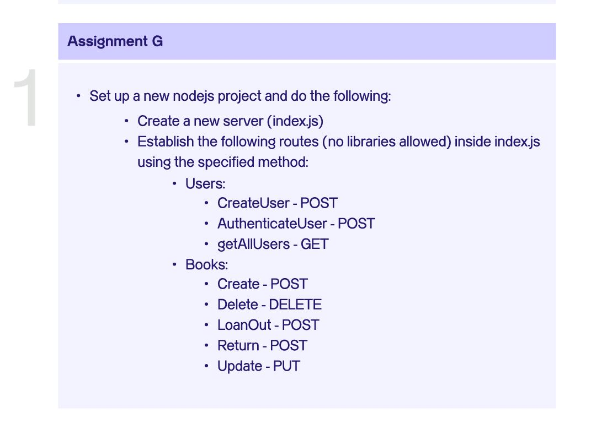

# Altschool Nodejs Project - One

After learning **Nodejs** in the second week of the second semester in Altschool, I started building this project in order to test what have learned so far.

## Table of contents

- [Overview](#overview)
  - [The project](#the-project)
- [My process](#my-process)
  - [Built with](#built-with)
  - [What I learned](#what-i-learned)
  - [Continued development](#continued-development)
  - [Useful resources](#useful-resources)
- [Author](#author)

## Overview

### The project

## My process

### Built with

- Nodejs

### What I learned

### Continued development

### Useful resources

[MDN](https://developer.mozilla.org/en-US/docs/Web/API/Fetch_API/Using_Fetch)

## Author

- Twitter - [@_davidudo](https://www.twitter.com/_davidudo)
- LinkedIn - [David Udo](https://www.linkedin.com/in/david-udo-1713b3231)
